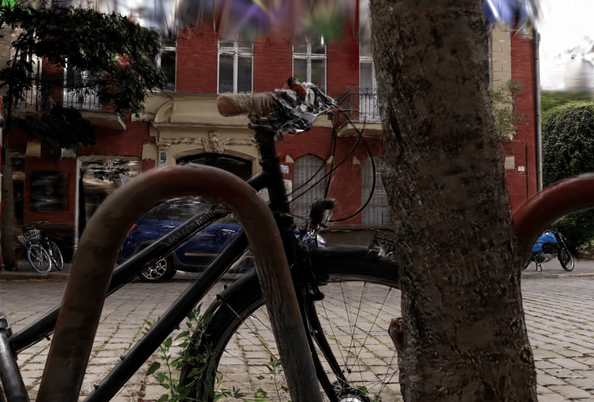

# splat_sor - Floater Cleanup for LichtFeld Studio

Outlier removal on a trained Gaussian splat, two methods:

- **Local density** (default): each Gaussian's mean distance to its K nearest
  neighbours is divided by the median of its neighbours' values. Floaters
  hugging thin detail (cables, spokes, edges) have a high ratio. Local ratio
  3.0 is a safe start; ~2x slower than Global.
- **Global SOR**: one threshold for the whole scene, mean + std_ratio * std.
  Catches floaters out in empty space, but misses floaters next to dense
  geometry because the sparse background sets the threshold.

## Install

In LichtFeld Studio open the Plugin Marketplace, paste
`https://github.com/felixgeen/lichtfeld-floater-cleanup` into the install
field and click Install Plugin. Or copy this folder to
`%USERPROFILE%\.lichtfeld\plugins\splat_sor\` (Linux: `~/.lichtfeld/plugins/`)
and restart. numpy and scipy are installed automatically on first load.
The panel appears as a "Floater Cleanup" tab.

Requires LichtFeld Studio 0.5.0 or later. License: GPL-3.0-or-later.

## Parameters

**Target**
- Target: selected splat nodes, or all visible splat nodes
- Only inside selection: analyse just the Gaussians selected with LichtFeld's
  selection tools, so the statistics come from that area alone. Box-select
  around the problem area first. Single-splat scenes only.
- Action: hide outliers (soft delete, restorable) or only select them

**Outlier test**
- Method: Local density (fine detail) or Global SOR (open space)
- Neighbors (K): 4-64, default 20. Higher is more robust but slower.
- Local ratio: 1.5-6.0, default 3.0. How many times sparser than its
  neighbours a Gaussian must be. Lower removes more; below 2.0 real detail
  starts to go. Local method only.
- Std ratio: 0.5-5.0, default 2.0. Lower removes more. Global method only.
- Passes: 1-3, default 1. Later passes reuse the first pass's threshold and
  catch small floater clumps that shielded each other.

**Opacity**
- Also prune low opacity + Min opacity: optional, default off / 0.05.
  0.05-0.15 is safe; above 0.25 starts eating soft edges.

## UI

The panel is a retained RML template (panels/main_panel.rml + .rcss) using
LichtFeld's ScrubFieldController, the same scrub fields as the built-in panels:
drag a field left/right to change it, click it to type a value, Esc cancels.
Settings are locked while a cleanup runs.

## Compare (A/B)

After a cleanup, the Compare card lets you check its impact in the viewport:

- Hold for original: shows the original while the button is held
- Show original / Show cleaned: latches the original on until clicked again

Each new Run starts from the original (the previous unbaked result is undone
first), so you can tweak settings, re-run and compare. Bake locks a result in.

## Buttons

- Run cleanup: analyses on a background thread, then applies
- Restore: brings back everything the last cleanup hid (Ctrl+Z also works)
- Bake (permanent): removes hidden Gaussians from memory before export
